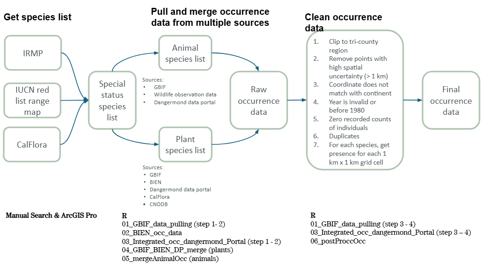

## Codes

Study area: the Dangermond Preserve in Santa Barbara county located within the tri-county region in southern California (Santa Barbara, Ventura, San Luis Obispo)

### Species occurrence data pulling and cleaning

#### Input data: 
* Integrated Resources Management Plan (IRMP): get special status species
* IUCN red list range maps: get specieal status species
* CalFlora: get special status species

#### R codes:
* [01_GBIF_data_pulling.R](../code/01_GBIF_data_pulling.R)
    * Purpose: step 1 -2 grab GBIF data for target species, and step 3 - 4 clean species data.
    * Birds data accessed on 05/18/2025.
    * Mammals data accessed on 05/07/2025.
    * Herps and invertebrates data accessed on 04/30/2025.
    * Plants data accessed on 05/15/2025.
* [02_BIEN_occ_data.R](../code/02_BIEN_occ_data.R)
    * Purpose: step 1 -2 grab BIEN data for target species, and step 3 - 5 clean species data.
    * Plants data accessed on 05/15/2025.
* [03_Integrated_occ_dangermond_Portal.R](../code/03_Integrated_occ_dangermond_Portal.R)
    * Purpose: grab data from the Dangermond Data Portal and Calflora and clean species data.
* [04_GBIF_BIEN_DP_Cal_merge.R](../code/04_GBIF_BIEN_DP_Cal_merge.R)
    * Purpose: merge plant species data from multiple sources.
* [05_mergeAnimalOcc.R](../code/05_mergeAnimalOcc.R)
    * Purpose: merge animal species data from multiple sources.
* [06_postProccOcc.R](../code/06_postProccOcc.R)
    * Purpose: final clean up step to get a single model-ready occurrence data file for all species.
* [07_KDE_background.R](../code/07_KDE_background.R)
    * Purpose: generate bias-corrected background points for all species
#### Output data:
* Final cleaned data for all species, projected to NAD California Zone 5

Example:

| species | x | y |
| -------| --- | --- |
| species latin name | longitude | latitude |

### Environmental layers

We built a set of physical, terrain, and climate predictors for the tri-county region (Santa Barbara, Ventura, San Luis Obispo), including current (1980–2010) and future (2040–2070) climate scenarios.

#### Inputs

* SRTM 1 Arc-Second Global DEM (USGS EarthExplorer)
* Ecological Coastal Units (ECU) coastline layer
* Annual solar radiation raster (ArcGIS Pro Area Solar Radiation)
* CHELSA v2.1 bioclimatic variables (bio1–bio19, 1981–2010)
* CHELSA CMIP6 (GFDL-ESM4, SSP126/370/585, 2040–2070)
* Refined tri-county boundary + 100 m buffer
* Common raster template (`raster_template.tif`, EPSG:2229)

#### R codes:
* [11_climate_stack_baseline.R](../code/11_climate_stack_baseline.R)
  * Purpose: Preprocesses CHELSA baseline bioclimatic rasters, runs multicollinearity filtering, and saves the selected climate stack for modeling.
* [12_env_layers_terrain_climate_stack.R](../code/12_env_layers_terrain_climate_stack.R)
  * Purpose: Derives terrain, solar, and distance-to-coast layers, aligns them with the selected climate stack, and builds scenario-specific environmental stacks.
* [13_full_env_stack.R](../code/13_full_env_stack.R)
  * Purpose: Extends the current environmental stack by adding any missing CHELSA bioclimatic variables to create a full baseline predictor stack.

#### Output data:
* `final_env_1980_2010_stack.tif` – Baseline environmental stack (terrain, solar, distance to coast, selected CHELSA bioclim variables) for SDMs.  
* `final_env_ssp126_2040_2070_stack.tif` – Future environmental stack under CHELSA CMIP6 GFDL-ESM4 SSP126.  
* `final_env_ssp370_2040_2070_stack.tif` – Future environmental stack under CHELSA CMIP6 GFDL-ESM4 SSP370.  
* `final_env_ssp585_2040_2070_stack.tif` – Future environmental stack under CHELSA CMIP6 GFDL-ESM4 SSP585.  
* `full_env_1980_2010_stack.tif` – Baseline stack extended with all CHELSA bio1–bio19 plus terrain and solar (for sensitivity/alternative modeling).

### Models and evaluation
#### Input data: 
* Species occurrence points
* Species pseudo-absence points
* Environmental and climatic predictor variables

#### R codes:
* [22_sdm_model.R](../code/22_sdm_model.R)
    * Purpose: Builds GAM, Random Forest, MaxEnt, and ensemble models for each species, and generates associated model statistics.
* [22_sdm_model_kfold.R](../code/22_sdm_model_kfold.R)
    * Purpose: Conducts K-fold evaluation.
* [23_model_projection.R](../code/23_model_projection.R)
    * Purpose: Projects future species distributions and calculates richness distribution for each taxon.
* [24_model_evaluation_summary.R](../code/24_model_evaluation_summary.R)
    * Purpose: Evaluates model uncertainty between scenarios, writes variable importance and AUC from the models, plots percentage variable importance, and plots intermodel uncertainty.

#### Output data:
* Model performance metrics, including AUC values
* Variable-importance plots
* Maps of current and projected future species distributions, including richness distribution.

