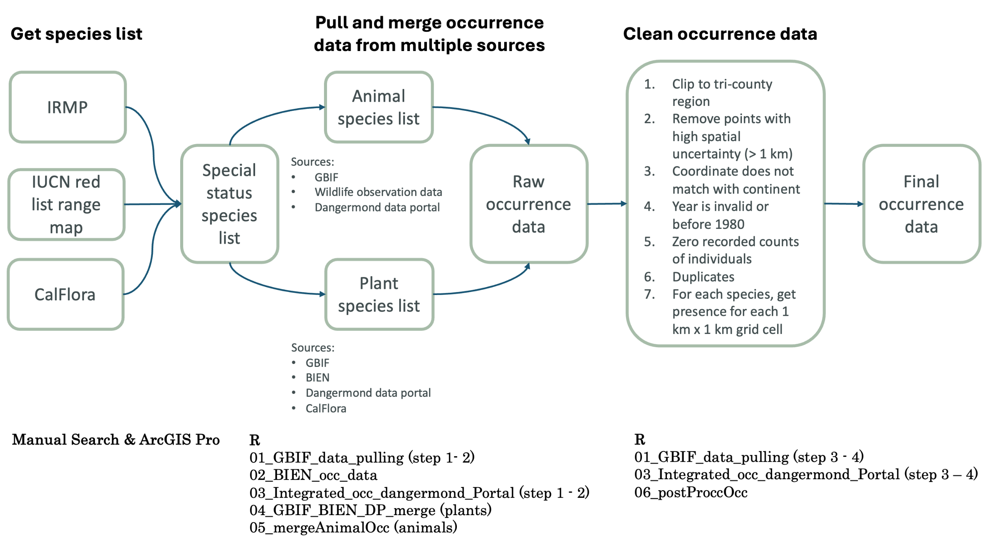

## Codes

Study area: the Dangermond Preserve in Santa Barbara county located within the tri-county region in southern California (Santa Barbara, Ventura, San Louis Obispo)

### Species occurrence data pulling and cleaning

#### Input data: 
* Integrated Resources Management Plan (IRMP): get special status species
* IUCN red list range maps: get specieal status species
* CalFlora: get specieal status species

#### R codes:
* [01_GBIF_data_pulling.R](../code/01_GBIF_data_pulling.R)
    * Purpose: step 1 -2 grab GBIF data for target species, and step 3 - 4 clean species data.
    * Birds data accessed on 05/18/2025.
    * Mammals data accessed on 05/07/2025.
    * Herps and invertebrates data accessed on 04/30/2025.
    * Plants data accessed on 05/15/2025.
* [02_BIEN_occ_data.R](../code/02_BIEN_occ_data.R)
    * Purpose: step 1 -2 grab BIEN data for target species, and step 3 - 5 clean species data.
    * Plants data accessed on 05/15/2025.
* [03_Integrated_occ_dangermond_Portal.R](../code/03_Integrated_occ_dangermond_Portal.R)
    * Purpose: grab data from the Dangermond Data Portal and Calflora and clean species data.
* [04_GBIF_BIEN_DP_Cal_merge.R](../code/04_GBIF_BIEN_DP_Cal_merge.R)
    * Purpose: merge plant species data from multiple sources.
* [05_mergeAnimalOcc.R](../code/05_mergeAnimalOcc.R)
    * Purpose: merge animal species data from multiple sources.
* [06_postProccOcc.R](../code/06_postProccOcc.R)
    * Purpose: final clean up step to get a single model-ready occurrence data file for all species.

#### Output data:
* Final cleaned data for all species, projected to NAD California Zone 5

Example:

| species | x | y |
| -------| --- | --- |
| species latin name | longitude | latitude |

### Envi_layer_elev_stack.R

The script section 1-5 generates slope, aspect, TRI, and flow accumulation layers from elevation (SRTM 30m) layer
* Load and filter county boundaries
* Mosaic and clip SRTM DEM
* Compute slope, aspect, TRI, flow accumulation, and distance to coast layers

The script section 6 stacks climate and terrain layers
* Load slope, aspect, flow accumulation, distance to coast, solar, and climate layers
* Clips and resamples all layers to match a common raster template provided by Lei to standardize projection (EPSG:2229), extent, and resolution
* Stacks layers for both current (1980–2010) and future climate scenarios (2040–2070)
* Saves outputs in organized folders under SDM_EnvLayers/Stack_Env/

### Models and evaluation
#### Input data: 
* Species occurrence points
* Species pseudo-absence points
* Environmental and climatic predictor variables

#### R codes:
* [22_ssdm_model.R](../code/22_ssdm_model.R)
    * Purpose: Builds GAM, Random Forest, MaxEnt, and ensemble models for each species, and generates associated model statistics.
* [23_model_projection.R](../code/23_model_projection.R)
    * Purpose: Projects future species distributions and calculates richness distribution for each taxon.
* [24_model_evaluation.R](../code/24_model_evaluation.R)
    * Purpose: Evaluates model uncertainty between scenarios, writes variable importance and AUC from the models, and plots percentage variable importance.

#### Output data:
* Model performance metrics, including AUC values
* Variable-importance plots
* Maps of current and projected future species distributions, including richness distribution.

#### Rangebagging Models:
* Modeled three low occurrence species (defined as < 10 occurrences) using the bssdm package and rangebagging approach.
* [41_LowOccurence_DataCleaning.R](../code/41_LowOccurence_DataCleaning.R) compiles and cleans CNDDB data for low occurrence species.
* [42_LowOccurence_Rangebagging.R](../code/42_LowOccurence_Rangebagging.R) runs rangebagging models for each species and calculates the AUC score for each model.
